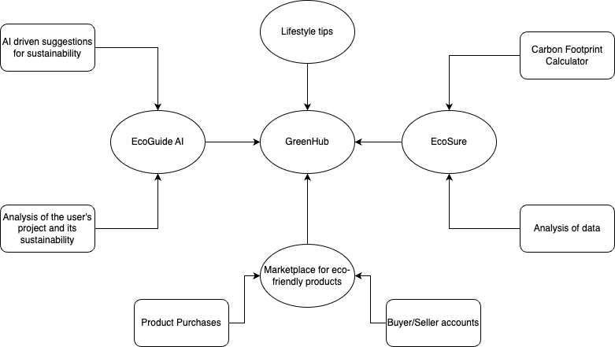

# GreenHub: Sustainability E-Commerce Website

## Table of Contents

1. [Introduction](#introduction)
2. [Features](#features)
    - [Sustainability Tips](#sustainability-tips)
    - [Marketplace](#marketplace)
    - [EcoGuide AI Assistant](#ecoguide-ai-assistant)
    - [EcoScore](#ecoscore)
3. [Installation](#installation)
4. [Usage](#usage)
5. [UML Diagrams](#uml-diagrams)
    - [Class Diagram](#class-diagram)
    - [Use Case Diagram](#use-case-diagram)
6. [Contributing](#contributing)
7. [License](#license)

## Introduction

GreenHub is a sustainability-focused e-commerce website aimed at promoting and facilitating eco-friendly practices. The platform combines an extensive marketplace for sustainable products with informative resources, an AI assistant, and a unique EcoScore feature to measure and visualize carbon footprints.

## Features

### Sustainability Tips

The website offers a comprehensive section on sustainability tips, providing users with practical advice and information on adopting eco-friendly practices in their daily lives.

### Marketplace

GreenHub hosts a marketplace where users can buy and sell a wide range of sustainable and eco-friendly products. This creates a community-driven platform for promoting environmentally conscious consumerism.

### EcoGuide AI Assistant

Introducing EcoGuide, an AI assistant designed to analyze project descriptions and suggest sustainable practices. Users can leverage EcoGuide to enhance the eco-friendliness of their projects based on tailored recommendations.

### EcoScore

The EcoScore feature calculates the carbon footprint of user activities and projects. The data is visualized, offering users insights into their environmental impact and encouraging sustainable choices.

## Installation

To get started with GreenHub, follow these steps:

1. Clone the repository.

    ```bash
    git clone https://github.com/ShashankBhake/sus_tainable.git
    ```

2. Install dependencies.

    ```bash
    npm install
    ```

3. Run the application.
    ```bash
    npm start
    ```

## Usage

Once the application is running, visit [http://localhost:3000](http://localhost:3000) in your browser to access GreenHub.

## UML Diagrams

### Use Case Diagram



## Contributing

We welcome contributions! If you'd like to contribute to GreenHub, please follow our [Contribution Guidelines](CONTRIBUTING.md).

## License

This project is licensed under the [MIT License](LICENSE).
